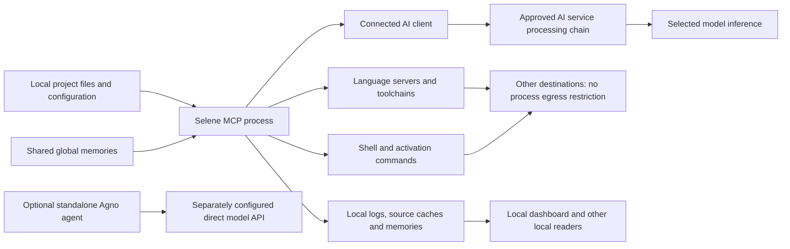

# Selene data-flow audit

Date: 2026-09-13. Policy assessed: project data may leave the controlled local environment only through the company's approved AI service and its approved processing chain. Under a literal restriction on **all** outbound data, even unrelated metadata requests fail the policy.

## Verdict

**Subsequent isolated-profile change:** [the local stdio deployment](docs/02-usage/073_isolated_stdio.md) adds an OS-enforced container/network boundary, disables application and daemon stream logging, and disables document-symbol cache persistence. Its scope and test evidence are separate from this original audit. The native launch path assessed below remains unconfined.

**The current build does not enforce this policy and should not yet be approved for a workload requiring that guarantee.**

The standard MCP server returns requested information to its connected client. It does not select an AI model, authenticate a model provider, or enforce the client's company policies. It has no destination allowlist or operating-system restriction on its own subprocesses. Language servers and commands receive access to sensitive data and can communicate independently.

The earlier removal of maintainer reporting, remote dashboard content and API-based token counting still stands. This follow-up found no evidence of a remaining first-party mechanism deliberately uploading project source to the original developers. It established additional exposure and retention paths, including ordinary logs, persistent source caches, ignored-file reads, symlinks and shared memories. These findings describe capabilities and observed synthetic behavior; they are not evidence that real company data has already been stolen.

No runtime code was changed during this follow-up. The new work consists of this analysis, reproducible probes and their evidence files. The earlier implementation/remediation record is [SECURITY_AUDIT.md](/Users/alexp/workspace/side/local-ai-marketplace/selene/SECURITY_AUDIT.md).

## What the Copilot example actually means

Selecting GPT-5.6 Luna in Copilot does not make the model vendor the only processor. GitHub lists Luna among models hosted by OpenAI and GitHub's Azure infrastructure. Copilot also processes requests and responses through its content filters. GitHub describes a zero-data-retention agreement with OpenAI and a business-data no-training commitment. This describes the published service arrangement, not verified settings for your company. [GitHub model hosting](https://docs.github.com/en/copilot/reference/ai-models/model-hosting)

The approval boundary therefore needs to identify the Copilot service, the selected model's hosting/processing chain, the company account and the applicable features. Selene cannot inspect or enforce the company's contract, seat assignment, retention terms, geography or selected model. GitHub documents that organization/enterprise policies depend on the license providing access and that support differs across surfaces. [GitHub enterprise and organization policies](https://docs.github.com/en/copilot/concepts/enterprise/policies)

Provider zero retention also does not imply that every client-side log or every Copilot feature has zero retention. GitHub publishes different default retention behavior for IDE chat/completions and other Copilot access. The exact client, plan and company agreement were not available for this audit. No conclusion about their actual configuration is possible from this repository. [Copilot data-handling FAQ](https://github.com/features/copilot)

Copilot's content-exclusion settings must not be assumed to protect MCP-returned content. GitHub currently documents limitations for Edit/Agent modes, indirect semantic information and symlinks. Independently, the Selene probe demonstrated that its own file reader returns gitignored content. [GitHub content-exclusion limitations](https://docs.github.com/en/copilot/concepts/context/content-exclusion)

## End-to-end flow



This diagram identifies possible paths. It does not imply that every component runs, that every tool result is necessarily forwarded in full, or that every language server uploads source.

| Stage | Data used | Processing and recipient |
| --- | --- | --- |
| Startup and activation | Project roots/names, configuration, languages, encoding, tool/mode lists, instructions and memory names | Loaded by Selene; some information becomes MCP instructions or activation results. Selected memory references can expand into full memory text. |
| File/search tools | Source, comments, documentation, filenames and any readable requested text, including secrets | Read locally and returned to the client. The file reader loads the whole file before line slicing. Size limits control answer length; they are not a secret filter. |
| Semantic tools | Whole opened documents, URIs, workspace paths, symbol names/bodies, references, diagnostics and type information | Local language-server process receives LSP messages. Selene formats requested results for the client and stores symbol data locally. |
| Edits and commands | New code, replacement text, command strings, working directories and command output | Applied locally. Commands execute with the process user's privileges and inherited environment. Results and arguments can also enter logs. |
| MCP return | Tool results/errors and instructions | Sent to the connected client over stdio by default; optional HTTP transports are configurable. The client decides what it sends onward and what it stores. |
| Reuse | Memories, cached source/symbols, configured instructions | Used in later tool calls or sessions. No company/model labels prevent reuse through a different client or provider. |
| Optional direct AI app | Conversation, tool results, history and system instructions | Agno calls its explicitly configured model API using separate credentials. This is a separate path from a Copilot session. |

The standard MCP path contains no discovered remote embedding/vector database or model-training pipeline. Semantic analysis runs through local language tools. Returning a small symbol to the model does **not** mean that only that symbol was read, delivered to a language server, or persisted locally.

## Findings and evidence

### D01 — No provider binding or process egress enforcement — blocking

Selene creates a FastMCP server and returns tools to clients. Client identification and context names do not establish a trusted provider identity. The same server can be used through another client or model. Prompts asking an agent to preserve privacy provide no enforcement against a compromised client, prompt injection or arbitrary executable.

Managed subprocess environments copy the parent environment and add telemetry opt-outs. This can pass API keys, registry tokens, proxy settings, cloud credentials and agent sockets to child programs when present. The audit inspected the mechanism without printing real credential values. A synthetic environment value was inherited by a managed child; the shell helper also posted that value to a separate loopback service. The helper is the one called by `execute_shell_command`.

The probe proves the absence of an application-level MCP-only destination policy. It made no Internet send and does not establish which destinations a separately configured host firewall would allow.

Evidence: [MCP creation](/Users/alexp/workspace/side/local-ai-marketplace/selene/src/selene/mcp.py:377), [child environment](/Users/alexp/workspace/side/local-ai-marketplace/selene/src/solidlsp/util/privacy.py:27), [shell execution](/Users/alexp/workspace/side/local-ai-marketplace/selene/src/selene/util/shell.py:17), [observations](/Users/alexp/workspace/side/local-ai-marketplace/selene/security/data-use-verification.json).

### D02 — Language servers and commands can access more than the returned result — blocking

Opening a document sends the full current text to a language server. Language servers also receive workspace roots and can read files, resolve dependencies and execute tooling using their own implementation. Restricting the length of an MCP response does not restrict these processes.

The shell tool accepts arbitrary command text and an absolute working directory outside the active project. Removing this tool alone would leave language-server subprocesses and toolchain execution available. Project activation commands and project-specific language-server settings have trust checks, but those checks are not a filesystem or network sandbox. The new-user configuration template trusts no project paths; the dataclass compatibility default trusts all paths when that setting is absent. Deployment must inspect the effective configuration.

Evidence: [LSP document contents](/Users/alexp/workspace/side/local-ai-marketplace/selene/src/solidlsp/ls.py:123), [shell tool](/Users/alexp/workspace/side/local-ai-marketplace/selene/src/selene/tools/cmd_tools.py:11), [activation commands](/Users/alexp/workspace/side/local-ai-marketplace/selene/src/selene/agent.py:1257), [configuration default](/Users/alexp/workspace/side/local-ai-marketplace/selene/src/selene/config/selene_config.py:898), [new-user template](/Users/alexp/workspace/side/local-ai-marketplace/selene/src/selene/resources/selene_config.template.yml:217).

### D03 — Tool payloads are copied into ordinary logs — high

The MCP wrapper invokes tools with call logging enabled. At normal INFO level, Selene logs complete tool parameters and result strings. Startup instructions are logged too. The CLI sends logs to a disk file, stderr and the dashboard's in-memory handler. Thus source, memory contents, edits, shell output and secrets present in those strings can have additional copies even if only one MCP response was requested.

A real stdio MCP session confirmed source text in both the disk log and captured client stderr. Writing and deleting a synthetic memory removed the memory file but left its content in the log. The dashboard's clear-logs action clears its in-memory list, not the disk file or client copies. There is no discovered automatic disk-log expiry or comprehensive payload redaction.

Evidence: [MCP logging enabled](/Users/alexp/workspace/side/local-ai-marketplace/selene/src/selene/mcp.py:100), [parameter log](/Users/alexp/workspace/side/local-ai-marketplace/selene/src/selene/tools/tools_base.py:279), [result log](/Users/alexp/workspace/side/local-ai-marketplace/selene/src/selene/tools/tools_base.py:410), [log handlers](/Users/alexp/workspace/side/local-ai-marketplace/selene/src/selene/cli.py:338), [dashboard clearing](/Users/alexp/workspace/side/local-ai-marketplace/selene/src/selene/dashboard.py:232).

### D04 — Ignore patterns and lexical project boundaries do not prevent secret reads — high

`read_file` validates with `require_not_ignored=False`. A synthetic `.env` excluded by `.gitignore` was returned successfully. Ignore patterns primarily influence discovery/search behavior; they do not establish a universal access policy across tools.

Project containment uses lexical path normalization and deliberately permits symlinks. A symlink inside the synthetic project returned an outside file. Direct `../` traversal was rejected, so this finding specifically concerns symlink resolution and other explicitly supported external-file paths. The memory manager similarly allowed a symlinked memory subdirectory to reach an outside file.

These behaviors can disclose unintended files to the otherwise approved AI provider and to local logs. No secret detection or per-company file ACL is applied before returning the contents.

Evidence: [file tool](/Users/alexp/workspace/side/local-ai-marketplace/selene/src/selene/tools/file_tools.py:27), [project containment](/Users/alexp/workspace/side/local-ai-marketplace/selene/src/selene/project.py:294), [path validation](/Users/alexp/workspace/side/local-ai-marketplace/selene/src/selene/project.py:328), [memory paths](/Users/alexp/workspace/side/local-ai-marketplace/selene/src/selene/memories/memory_manager.py:151), [synthetic results](/Users/alexp/workspace/side/local-ai-marketplace/selene/security/data-use-verification.json).

### D05 — Persistent caches and memories lack company/provider separation — high

`SymbolBody` retains the file's line buffer, not just the selected symbol text. Persisting the document-symbol cache therefore stores source outside the requested symbol. With real Pyright 1.1.403, a synthetic comment preceding a function appeared in `document_symbols.pkl` after requesting document symbols. It remained immediately after deleting the original source file. This does not prove indefinite retention after every possible later cache rebuild; there is no coordinated deletion guarantee.

Global memories under the same Selene home are accessible across projects. The probe confirmed that a second project's manager could read the first project's global memory. Reconnecting through another provider does not isolate existing memory content. Memory names are advertised in relevant prompts; selected references can include their text.

The automatically created project `.selene/.gitignore` ignores cache and project-local configuration, but not memories. Memories can consequently be committed and later pushed by normal Git operations. Selene does not automatically push them.

With umask `022`, the observed log, memory and cache files had mode `0644`. Parent-directory permissions still determine whether another user can reach them; the temporary audit directories were private. The result establishes that these writers do not themselves enforce owner-only file modes, not that another user successfully read them in this test.

Evidence: [symbol buffer](/Users/alexp/workspace/side/local-ai-marketplace/selene/src/solidlsp/ls.py:224), [cache persistence](/Users/alexp/workspace/side/local-ai-marketplace/selene/src/solidlsp/ls.py:3083), [cache probe result](/Users/alexp/workspace/side/local-ai-marketplace/selene/security/cache-data-verification.json), [shared memory directory](/Users/alexp/workspace/side/local-ai-marketplace/selene/src/selene/memories/memory_manager.py:28), [project creation](/Users/alexp/workspace/side/local-ai-marketplace/selene/src/selene/project.py).

### D06 — Local HTTP services are not authenticated tenant boundaries — high when reachable by untrusted parties

The dashboard is enabled by default and listens on loopback. Its API exposes logs and project/configuration/memory operations without an authentication token. A Flask test-client request retrieved a synthetic source-bearing log without authentication. An unrelated Host header was correctly rejected. This test does not demonstrate a malicious website bypassing browser same-origin protections.

Loopback reduces network exposure but does not authenticate other local processes. Dashboard CSP, no-store and host validation are useful controls; they do not provide tenant isolation. MCP HTTP connections share an agent instance. The optional project server restricts tools to read-only operations but permits queries against registered projects without per-client project authorization. Explicitly configured remote IDE/project endpoints use HTTP and can carry source or edits to another machine.

The included Compose file is not a verified isolation solution: it has no outbound-network restriction and invokes `selene-mcp-server`, while the package exposes `selene`. Its dashboard port mapping is also stale. These are source findings; Docker deployment was not executed in this audit.

Evidence: [dashboard defaults](/Users/alexp/workspace/side/local-ai-marketplace/selene/src/selene/config/selene_config.py:852), [dashboard routes](/Users/alexp/workspace/side/local-ai-marketplace/selene/src/selene/dashboard.py:199), [shared MCP agent](/Users/alexp/workspace/side/local-ai-marketplace/selene/src/selene/mcp.py:402), [project query](/Users/alexp/workspace/side/local-ai-marketplace/selene/src/selene/project_server.py:122), [Compose](/Users/alexp/workspace/side/local-ai-marketplace/selene/compose.yaml), [entrypoint](/Users/alexp/workspace/side/local-ai-marketplace/selene/pyproject.toml:56).

### D07 — Remaining non-AI outbound traffic is incompatible with a literal provider-only rule — blocking

| Trigger | Possible recipient and data | Evidence/status |
| --- | --- | --- |
| Solidity 0.8.4 startup | GitHub raw content and Solidity compiler catalog; IP/time/TLS/request metadata | Earlier real-server probe recorded fixed GET attempts to `https://raw.githubusercontent.com/NomicFoundation/hardhat-vscode/development/flags.json` and `https://binaries.soliditylang.org/wasm/list.json`, with telemetry disabled. No source field was present in those requests. |
| Missing language-server dependency | PyPI, npm, GitHub releases, Maven, NuGet, VS Code Marketplace and language registries | Automatic provisioning may disclose package/version/platform information. Package-manager configuration can add credentials and project dependency names. Adapter inventory lists individual implementations. |
| Language-server project analysis/build | Configured registries, Git hosts, compiler/dependency services and any executable-selected destination | Depends on language, project and installed binary. No general source-send prohibition is enforced. |
| Licensed server/runtime | Vendor activation/account services | Supplying an Intelephense key permits activation at `intelephense.com/activate`; key and machine/product information can be involved. Proprietary runtimes remain separate trust dependencies. |
| Optional tiktoken with empty cache | Public vocabulary storage | Download metadata only; counted project text is processed locally. Default `CHAR_COUNT` avoids this. |
| Explicit remote IDE/project/LSP configuration | Configured host | Source, paths, queries, edits and diagnostics, depending on API. Direct HTTP helpers refuse proxy inheritance and redirects but allow the configured endpoint. |
| Shell/custom adapter/activation | Arbitrary destination selected by the program | Potentially any readable data or inherited credential. No application destination restriction. |
| Manual developer operations | Git host, CI service, registry or artifact host | Normal Git/CI/package-tool behavior. Remaining GitHub workflows require manual dispatch; CodeQL may upload analysis. No upstream Git remote is configured in this checkout. |

Opt-out variables are advisory. An installed tool may ignore them, persist a separate telemetry preference, launch another program or use native networking. Go's persistent telemetry mode, package-manager configuration, proprietary tools and unreviewed language-server versions need deployment-specific control. Existing downloads are not uniformly immutable or fully locked through all transitive dependencies.

Evidence: [all adapter resources](/Users/alexp/workspace/side/local-ai-marketplace/selene/security/language-server-inventory.md), [real language-server observations](/Users/alexp/workspace/side/local-ai-marketplace/selene/security/lsp-verification.json), [token counting](/Users/alexp/workspace/side/local-ai-marketplace/selene/src/selene/analytics.py:23), [previous endpoint analysis](/Users/alexp/workspace/side/local-ai-marketplace/selene/SECURITY_AUDIT.md).

### D08 — Optional direct-model integrations need independent approval — conditional

The standalone Agno example uses separately supplied model credentials and currently defaults to a Claude model. Running it does not inherit a Copilot company's service agreement merely because Copilot is installed. It stores conversation data in local SQLite, includes up to 100 history runs in model context, and removes the existing database on the next agent creation rather than guaranteeing deletion on shutdown.

Agno telemetry and tracing are disabled in this checkout. The installed framework has other model defaults, so the memory-manager initialization was also traced: this configured agent assigns its chosen model to the manager; automatic memory updates and agentic memory default off. No additional default-provider inference was established on this path. Startup verification made no model call, so provider behavior during actual inference was not tested. Google/Grok examples are additional explicit, separately credentialed entrypoints.

Evidence: [Agno integration](/Users/alexp/workspace/side/local-ai-marketplace/selene/src/selene/agno.py:115), [standalone script](/Users/alexp/workspace/side/local-ai-marketplace/selene/scripts/agno_agent.py), [startup verification](/Users/alexp/workspace/side/local-ai-marketplace/selene/security/agno-verification.json), installed `agno/agent/_init.py::set_memory_manager` and `agno/agent/agent.py` in the inventoried environment.

## Stored data and deletion

Local storage is not itself a third-party transfer. It creates additional copies that can later be read, backed up, synchronized or returned through another client. The actual machine's backup/sync/endpoint-security configuration was not inspected.

| Location | Contents and reuse | Retention/deletion behavior |
| --- | --- | --- |
| `SELENE_HOME/logs/YYYY-MM-DD/*.txt` (normally `~/.selene/logs`) | Tool inputs/results, errors, instructions, paths and operational messages | No automatic disk-log expiry found. Deleting a memory or clearing dashboard logs does not erase these files. |
| Client stderr/output logs | Selene's log stream, potentially including source and tool inputs | Retention belongs to the client/launcher. Selene cannot purge those copies. |
| Dashboard memory handler | Up to 2,500 retained log messages by default, potentially long payloads | In-memory list clears through the API or process exit. Separate disk/client copies remain. |
| Project `.selene/cache/<language>/` or configured project-data folder | Raw symbols, locations, hashes and higher-level caches containing source line buffers | Persistent cache files; refresh/invalidation is a correctness mechanism, not a deletion/retention contract. Restricted unpickling prevents arbitrary globals, not disclosure or plaintext persistence. |
| Project `.selene/memories/` | Agent/user-written Markdown, potentially code and company knowledge | Explicit write/edit/delete. Not automatically excluded from Git. Copies may remain in logs, backups, client histories or Git history. |
| `SELENE_HOME/memories/global/` | Markdown shared across projects using that home | Explicit deletion; no company or provider segregation. |
| Global/project YAML and local variants | Registered project paths, settings, initial instructions, commands, custom server settings | Persistent configuration. Secrets placed there receive no universal field-level redaction. |
| `SELENE_HOME/hook_data/<session>/` | Session counters/timestamps for symbolic-tool reminders | The configured session-end hook removes its session directory. Missing/crashed hook execution has no demonstrated fallback expiry. The hook reads its input JSON in memory; persisted counters are not a full conversation archive. |
| Agno `temp/agno_agent_storage.db` | Optional direct-agent sessions/history | Existing database deleted on next agent creation; not a verified secure erase or shutdown purge. |
| Language-server/toolchain caches | Server-dependent indexes, builds, diagnostics, dependencies and possibly source | Vendor/toolchain behavior; not centrally governed by Selene. |

The reviewed Selene writers provide no application-level encryption or coordinated erasure across these stores. OS encryption, permissions and backup policy can provide additional protection. Clearing a UI, deleting a source file or deleting one memory must not be represented as deleting every copy of that data.

Hooks and prompt templates were included in the review. Bundled privacy instructions do not request third-party source uploads. Some hooks guide tool choice or grant approvals in configured permissive client modes; they are not recipient checks. Project text, memories and custom prompts remain possible sources of malicious instructions to an AI client. The client must treat those as untrusted, and execution controls must withstand an agent following them.

## Verification and coverage limits

The prior repository inventory covers 1,047 files: 92 runtime files, 82 language-server adapter/resources, 38 instruction files, 17 dashboard assets, 36 build/configuration/scripts, 10 CI files, 52 documentation/artwork files and 720 tests/fixtures. **All 1,047 file hashes matched that inventory during this follow-up.** The inventory SHA-256 is `74e1f7be82a878939bb358dd90da2a8207b618e3e9894abf1c2d0b29e3d12855`. Reports/probes are recorded separately from this runtime baseline.

The dependency inventory records 201 installed distributions and 7,466 Python/JavaScript/PTH files. Relevant send/storage/process paths were traced selectively. This is not a line-by-line certification of every dependency, native extension, operating system, vendor executable or future release. Test fixtures were inventoried; their presence does not mean all language integrations were executed.

New observations used synthetic text and temporary homes/projects:

| Probe | Observed result |
| --- | --- |
| Real MCP stdio session, 29 tools discovered | Ignored `.env` and outside-file symlink contents returned; direct parent traversal blocked. |
| Normal MCP logging | Source and memory inputs in disk/stderr logs; deleted memory remains in log. Observed log/memory modes `0644` under umask `022`. |
| Dashboard Flask test client | Log retrieval and clearing without token; unrelated Host rejected. No browser-origin exploit tested. |
| Two local memory managers | Shared global memory accessible across projects; symlinked memory directory reaches outside file. |
| Managed child and shell helper | Synthetic environment value inherited and sent to an audit-owned loopback receiver. No Internet transfer attempted. |
| Real Pyright 1.1.403 | Comment outside returned function body present in persistent source cache; remains immediately after source deletion; cache mode `0644`; no network attempt recorded by Node hooks. |

Reproduce from the existing locked development environment:

```sh
uv run --no-sync python security/probes/data_use_audit.py
uv run --no-sync python security/probes/cache_data_audit.py \
  /absolute/path/to/node /absolute/path/to/pyright/dist/langserver.index.js
```

The first probe requires permission to create a loopback listener. The second requires an already installed Pyright 1.1.403. Neither intentionally contacts an Internet destination or invokes an AI model. Node hooks are instrumentation, not an OS network sandbox. Results are [data-use-verification.json](/Users/alexp/workspace/side/local-ai-marketplace/selene/security/data-use-verification.json) and [cache-data-verification.json](/Users/alexp/workspace/side/local-ai-marketplace/selene/security/cache-data-verification.json).

Earlier verification included 981 passing core tests, targeted PHP/JSON/YAML/Solidity processes, dashboard browser loading and optional Agno startup. Those results remain separately scoped in [verification.md](/Users/alexp/workspace/side/local-ai-marketplace/selene/security/verification.md); the full suite was not rerun for this report-only follow-up. Solidity's two attempted metadata calls are a known failed condition under the strict policy, even though its symbol operation succeeded.

No live company account, Copilot configuration, contractual terms, real model inference, proprietary IDE plugin, license activation, Docker deployment, OS-wide packet capture or complete cross-platform language-server matrix was audited. The report cannot establish how a remote provider internally handles data beyond its published commitments, or certify binaries it did not execute/review.

## Conditions required before approval

1. **Define and enforce the approved client service chain.** Use the company-managed account and approved model/features, with administrator controls and verified retention/processing terms. A model name in a UI or a Selene context file is insufficient evidence. Include the client's native tools and other MCP servers in the same assessment.
2. **Deny outbound networking for Selene and its entire process tree at the OS/container/VM boundary.** Standard stdio MCP does not need Selene to contact an AI provider itself; the approved client can own that connection. Block DNS and native/child networking too. Telemetry flags and Python/Node monkey patches cannot provide this guarantee. No such deployment was implemented or validated here.
3. **Provision immutable dependencies separately.** Prepare reviewed language servers and dependencies without a private workspace mounted, then run from populated caches with automatic installation/downloads disabled. Any provisioning metadata traffic needs an explicit policy exception if the requirement literally applies to all traffic at every stage.
4. **Limit accessible files and credentials.** Run with a minimal environment and dedicated filesystem scope, without home-directory credentials, agent sockets or unrelated projects. Implement canonical-path enforcement and a real secret/path policy across tools. Language servers and shell tools require the same restriction outside Python code.
5. **Separate storage by company and approved context.** Use dedicated Selene homes and project data directories. Prevent cross-company global memory reuse; define whether memories can enter Git and whether changing providers requires a fresh storage scope.
6. **Minimize and expire stored payloads.** Make ordinary logging metadata-only, apply redaction to errors and explicitly enabled diagnostics, enforce private modes, and implement bounded retention and clear deletion semantics for logs/caches/history. Raising the log level can reduce exposure now but does not establish a complete redaction guarantee.
7. **Use stdio and disable unnecessary listeners/integrations.** Disable the dashboard, tray/GUI paths, remote project/IDE endpoints and direct Agno integrations in the strict deployment. If HTTP is necessary, require authentication, transport protection and per-client project isolation. Fix and validate container packaging before relying on it.
8. **Run acceptance tests against the actual deployment.** Exercise each enabled language and client workflow with synthetic secret canaries while monitoring/enforcing OS-level egress. Include initialization, indexing, diagnostics, build/dependency resolution, errors, license/update timers, shell execution and reconnection under a different client. Verify that storage and project boundaries remain effective after failures and deletion.

These are remaining requirements, not controls already supplied by the checkout. The audit is complete at the stated scope; approval for the strict policy remains blocked by the concrete findings above and the unverified deployment/client boundaries.
